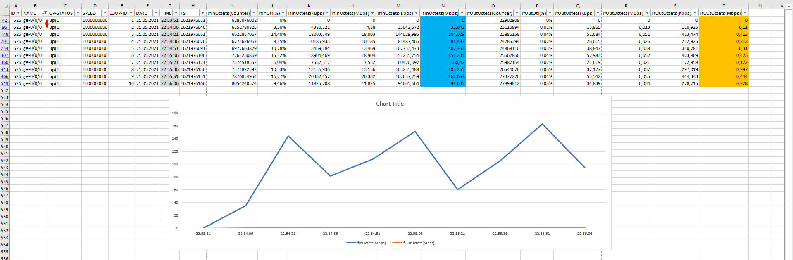

# measure-interface-traffic


# How tu use:
```bash
apt-get -y install snmp snmp-mibs-downloader
measure-interface-traffic.sh -a 192.168.1.226 -c public -i 10 -l 10
```
To save output to file use redirection or tee command.<br>
```bash
measure-interface-traffic.sh -a 192.168.1.226 -c public -i 10 -l 10 | tee stats.csv
```

```text
          || visible in terminal ||   visible in file   || existing
  Syntax  ||  StdOut  |  StdErr  ||  StdOut  |  StdErr  ||   file   
==========++==========+==========++==========+==========++===========
    >     ||    no    |   yes    ||   yes    |    no    || overwrite
    >>    ||    no    |   yes    ||   yes    |    no    ||  append
          ||          |          ||          |          ||
   2>     ||   yes    |    no    ||    no    |   yes    || overwrite
   2>>    ||   yes    |    no    ||    no    |   yes    ||  append
          ||          |          ||          |          ||
   &>     ||    no    |    no    ||   yes    |   yes    || overwrite
   &>>    ||    no    |    no    ||   yes    |   yes    ||  append
          ||          |          ||          |          ||
 | tee    ||   yes    |   yes    ||   yes    |    no    || overwrite
 | tee -a ||   yes    |   yes    ||   yes    |    no    ||  append
          ||          |          ||          |          ||
 n.e. (*) ||   yes    |   yes    ||    no    |   yes    || overwrite
 n.e. (*) ||   yes    |   yes    ||    no    |   yes    ||  append
          ||          |          ||          |          ||
|& tee    ||   yes    |   yes    ||   yes    |   yes    || overwrite
|& tee -a ||   yes    |   yes    ||   yes    |   yes    ||  append
```


# Output file:
```bash
root@azdolinsk:/root# bash measure-interface-traffic.sh -a 192.168.1.209 -c public -i 10 -l 10
ID;NAME;OP-STATUS;SPEED;LOOP-ID;DATE;TIME;TS;ifInOctets(Counter);ifInUtl(%);ifInOctets(KBps);ifInOctets(MBps);ifInOctets(Kbps);ifInOctets(Mbps);ifOutOctets(Counter);ifOutUtl(%);ifOutOctets(KBps);ifOutOctets(MBps);ifOutOctets(Kbps);ifOutOctets(Mbps)
1;fxp0;up(1);1000000000;1;2021-05-25;22:44:04;1621975444;7169451;0%;0;0;0;0;1193733;0%;0;0;0;0
4;lsi;up(1);0;1;2021-05-25;22:44:04;1621975444;0;0%;0;0;0;0;0;0%;0;0;0;0
5;dsc;up(1);0;1;2021-05-25;22:44:04;1621975444;0;0%;0;0;0;0;0;0%;0;0;0;0
6;lo0;up(1);0;1;2021-05-25;22:44:04;1621975444;1745288;0%;0;0;0;0;1745288;0%;0;0;0;0
7;tap;up(1);0;1;2021-05-25;22:44:04;1621975444;0;0%;0;0;0;0;0;0%;0;0;0;0
8;gre;up(1);0;1;2021-05-25;22:44:04;1621975444;0;0%;0;0;0;0;0;0%;0;0;0;0
9;ipip;up(1);0;1;2021-05-25;22:44:04;1621975444;0;0%;0;0;0;0;0;0%;0;0;0;0
10;pime;up(1);0;1;2021-05-25;22:44:04;1621975444;0;0%;0;0;0;0;0;0%;0;0;0;0
11;pimd;up(1);0;1;2021-05-25;22:44:04;1621975444;0;0%;0;0;0;0;0;0%;0;0;0;0
12;mtun;up(1);0;1;2021-05-25;22:44:04;1621975444;0;0%;0;0;0;0;0;0%;0;0;0;0
13;fxp0.0;up(1);1000000000;1;2021-05-25;22:44:04;1621975444;7159921;0%;0;0;0;0;1194627;0%;0;0;0;0
21;lo0.16384;up(1);0;1;2021-05-25;22:44:04;1621975444;0;0%;0;0;0;0;0;0%;0;0;0;0
22;lo0.16385;up(1);0;1;2021-05-25;22:44:04;1621975444;1745288;0%;0;0;0;0;1745288;0%;0;0;0;0
23;em1;up(1);1000000000;1;2021-05-25;22:44:04;1621975444;99266300;0%;0;0;0;0;55974682;0%;0;0;0;0
24;em1.0;up(1);1000000000;1;2021-05-25;22:44:04;1621975444;99266300;0%;0;0;0;0;55578692;0%;0;0;0;0
501;cbp0;up(1);0;1;2021-05-25;22:44:04;1621975444;0;0%;0;0;0;0;0;0%;0;0;0;0
502;demux0;up(1);0;1;2021-05-25;22:44:04;1621975444;0;0%;0;0;0;0;0;0%;0;0;0;0
503;esi;up(1);0;1;2021-05-25;22:44:04;1621975444;0;0%;0;0;0;0;0;0%;0;0;0;0
504;fti0;up(1);0;1;2021-05-25;22:44:04;1621975444;0;0%;0;0;0;0;0;0%;0;0;0;0
505;fti1;up(1);0;1;2021-05-25;22:44:04;1621975444;0;0%;0;0;0;0;0;0%;0;0;0;0
506;fti2;up(1);0;1;2021-05-25;22:44:04;1621975444;0;0%;0;0;0;0;0;0%;0;0;0;0
507;fti3;up(1);0;1;2021-05-25;22:44:04;1621975444;0;0%;0;0;0;0;0;0%;0;0;0;0
508;fti4;up(1);0;1;2021-05-25;22:44:04;1621975444;0;0%;0;0;0;0;0;0%;0;0;0;0
509;fti5;up(1);0;1;2021-05-25;22:44:04;1621975444;0;0%;0;0;0;0;0;0%;0;0;0;0
510;fti6;up(1);0;1;2021-05-25;22:44:04;1621975444;0;0%;0;0;0;0;0;0%;0;0;0;0
511;fti7;up(1);0;1;2021-05-25;22:44:04;1621975444;0;0%;0;0;0;0;0;0%;0;0;0;0
512;irb;up(1);0;1;2021-05-25;22:44:04;1621975444;0;0%;0;0;0;0;0;0%;0;0;0;0
513;jsrv;up(1);0;1;2021-05-25;22:44:04;1621975444;0;0%;0;0;0;0;0;0%;0;0;0;0
514;jsrv.1;up(1);1000000000;1;2021-05-25;22:44:04;1621975444;0;0%;0;0;0;0;0;0%;0;0;0;0
515;pip0;up(1);0;1;2021-05-25;22:44:04;1621975444;0;0%;0;0;0;0;0;0%;0;0;0;0
516;pp0;up(1);0;1;2021-05-25;22:44:04;1621975444;0;0%;0;0;0;0;0;0%;0;0;0;0
517;rbeb;up(1);0;1;2021-05-25;22:44:04;1621975444;0;0%;0;0;0;0;0;0%;0;0;0;0
518;vtep;up(1);0;1;2021-05-25;22:44:04;1621975444;0;0%;0;0;0;0;0;0%;0;0;0;0
519;lc-0/0/0;up(1);800000000;1;2021-05-25;22:44:04;1621975444;0;0%;0;0;0;0;0;0%;0;0;0;0
520;lc-0/0/0.32769;up(1);0;1;2021-05-25;22:44:04;1621975444;0;0%;0;0;0;0;0;0%;0;0;0;0
521;pfh-0/0/0;up(1);800000000;1;2021-05-25;22:44:04;1621975444;0;0%;0;0;0;0;0;0%;0;0;0;0
522;pfe-0/0/0;up(1);800000000;1;2021-05-25;22:44:04;1621975444;0;0%;0;0;0;0;0;0%;0;0;0;0
523;pfh-0/0/0.16383;up(1);0;1;2021-05-25;22:44:04;1621975444;0;0%;0;0;0;0;0;0%;0;0;0;0
524;pfh-0/0/0.16384;up(1);0;1;2021-05-25;22:44:04;1621975444;0;0%;0;0;0;0;0;0%;0;0;0;0
525;pfe-0/0/0.16383;up(1);0;1;2021-05-25;22:44:04;1621975444;0;0%;0;0;0;0;0;0%;0;0;0;0
526;ge-0/0/0;up(1);1000000000;1;2021-05-25;22:44:04;1621975444;5567009357;0%;0;0;0;0;20895810;0%;0;0;0;0
527;ge-0/0/1;down(2);1000000000;1;2021-05-25;22:44:04;1621975444;0;0%;0;0;0;0;0;0%;0;0;0;0
528;ge-0/0/2;up(1);1000000000;1;2021-05-25;22:44:04;1621975444;22112348;0%;0;0;0;0;5568030635;0%;0;0;0;0
529;ge-0/0/3;down(2);1000000000;1;2021-05-25;22:44:04;1621975444;0;0%;0;0;0;0;0;0%;0;0;0;0
530;ge-0/0/4;down(2);1000000000;1;2021-05-25;22:44:04;1621975444;0;0%;0;0;0;0;0;0%;0;0;0;0
531;ge-0/0/5;down(2);1000000000;1;2021-05-25;22:44:04;1621975444;0;0%;0;0;0;0;0;0%;0;0;0;0
532;ge-0/0/6;down(2);1000000000;1;2021-05-25;22:44:04;1621975444;0;0%;0;0;0;0;0;0%;0;0;0;0
533;ge-0/0/7;down(2);1000000000;1;2021-05-25;22:44:04;1621975444;0;0%;0;0;0;0;0;0%;0;0;0;0
534;ge-0/0/8;down(2);1000000000;1;2021-05-25;22:44:04;1621975444;0;0%;0;0;0;0;0;0%;0;0;0;0
535;ge-0/0/9;down(2);1000000000;1;2021-05-25;22:44:04;1621975444;0;0%;0;0;0;0;0;0%;0;0;0;0
536;ge-0/0/0.0;up(1);1000000000;1;2021-05-25;22:44:04;1621975444;5567009357;0%;0;0;0;0;20895426;0%;0;0;0;0
537;ge-0/0/1.0;lowerLayerDown(7);1000000000;1;2021-05-25;22:44:04;1621975444;0;0%;0;0;0;0;0;0%;0;0;0;0
538;ge-0/0/2.0;up(1);1000000000;1;2021-05-25;22:44:04;1621975444;22112348;0%;0;0;0;0;5568022985;0%;0;0;0;0
[...]
```


# Replace dots by commas if needed
```bash
sed 's/\./\,/g' traffic.csv > traffic_comma.csv
```

# Example Excel Output:
